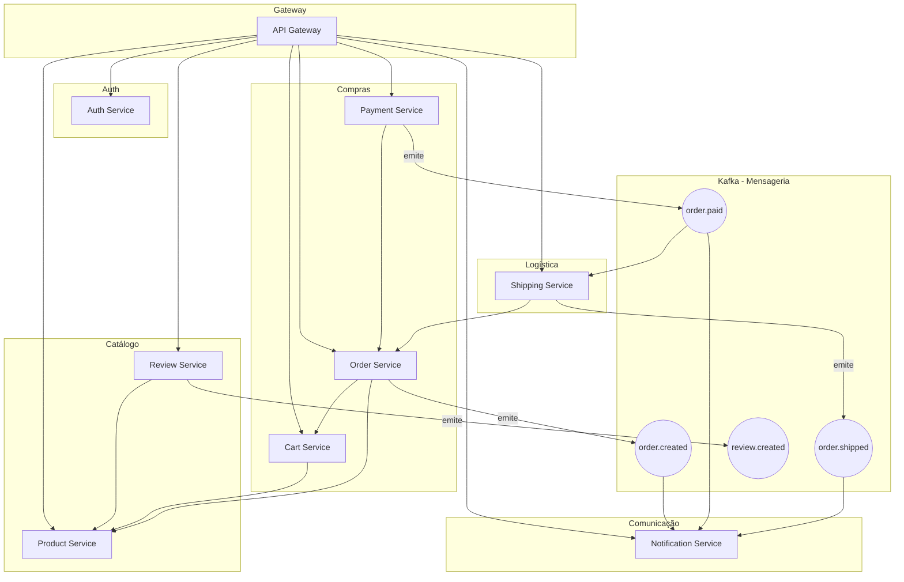

# 🛒 E-commerce Distribuído com Micro-serviços

Este projeto é uma implementação de um sistema de **e-commerce** utilizando **Java Spring Boot**, arquitetura de **micro-serviços**, **mensageria com Kafka**, e **API Gateway**. Ele cobre o fluxo completo de um processo de compra online, desde o cadastro de produtos até o envio e avaliação da entrega.

---

## 📦 Micro-serviços

### 🌐 API Gateway
- Roteamento de requisições para os micro-serviços
- Filtro de autenticação via JWT
- Logging (opcional)

---

### 🔐 Auth Service
- Cadastro e login de usuários (clientes e admins)
- Emissão de tokens JWT
- Validação e autenticação centralizada

---

### 🛍️ Product Service
- Cadastro e gerenciamento de produtos (admins)
- Listagem e busca de produtos por nome, categoria, etc.
- Estoque e precificação

---

### 🛒 Cart Service
- Carrinho de compras por usuário
- Adição, remoção e atualização de itens
- Cálculo de subtotal

---

### 📦 Order Service
- Geração de pedidos a partir do carrinho
- Gerenciamento de status (`PENDENTE`, `PAGO`, `ENVIADO`, `ENTREGUE`)
- Listagem de pedidos por usuário

---

### 💳 Payment Service
- Simulação de pagamentos (PIX, cartão, boleto)
- Confirmação ou falha no pagamento
- Emissão do evento `order.paid`

---

### 🚚 Shipping Service
- Simulação de envio do pedido
- Atualização do status de envio
- Recebe evento de pagamento confirmado

---

### 📣 Notification Service
- Escuta eventos (`order.created`, `order.paid`, `order.shipped`)
- Envia notificações simuladas (logs, e-mail, etc.)

---

### 📝 Review Service
- Avaliações e comentários de produtos
- Um review por produto por usuário
- Cálculo de média de avaliações por produto
- Consulta de reviews de um produto

---

## 🧪 Tecnologias

- Java 17 + Spring Boot
- Spring Cloud Gateway
- Spring Security + JWT
- Spring Data JPA
- Apache Kafka
- PostgreSQL (relacional)
- MongoDB (opcional em serviços de log ou histórico)
- Docker (infraestrutura)

---

## 📌 Status do MVP

- [x] Definição da arquitetura
- [ ] Implementação do Auth Service
- [ ] Cadastro e listagem de produtos
- [ ] Funcionalidades básicas do carrinho
- [ ] Geração e processamento de pedidos
- [ ] Simulação de pagamento e envio
- [ ] Integração de reviews e notificações

---

## 📤 Eventos Kafka (Mensageria)

| Evento                | Emissor           | Consumidores                         |
|----------------------|-------------------|--------------------------------------|
| `order.created`      | Order Service     | Notification Service                 |
| `order.paid`         | Payment Service   | Shipping Service, Notification       |
| `order.shipped`      | Shipping Service  | Notification Service                 |
| `review.created`     | Review Service    | (opcional: Product Service para cache) |

---

## 🧾 Entidades Principais

- `User`: cliente ou administrador
- `Product`: catálogo de produtos
- `Cart`: itens temporários por usuário
- `Order`: pedido realizado
- `Payment`: simulação de pagamento
- `Shipment`: controle de envio
- `Review`: avaliação de produto

---

# Diagrama

